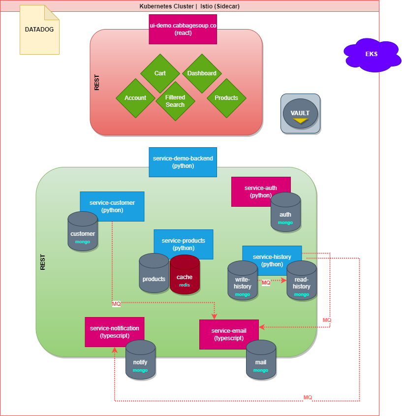

# Welcome to CabbageSoup!

## A professional ecommerce service and business landing site.



## Coming Soon v2.1
- Moving Product Images from Linode Server to Amazon S3
- Better Error Handling via Status Codes (401, 403 etc.)
- Replacing Binary Search with Elastic for Text & Voice Search
- Creating Machine Learning Recommendations
    - Top Categories
    - Recommended Products
    - What you will buy next
- Unit Tests & 100% Code Coverage

## Services
- Services Broken into a Domain Driven Microservices Architecture 
    - **python**
        - service-demo-backend
        - service-auth
        - service-history
        - service-products
        - service-customer
    - **node/typescript**
        - service-notification
        - service-email

Service-History has a CQRS (Command-Query Responsbility Segregation) Architecture to Seperate Read & Writes operations for better scalability. An event bus via RabbitMQ is used for sync across the write to read database.

- Responsive, Interactive UI to Showcase Professional Experience (ui-demo.cabbagesoup.co)
    - React
    - HTML5 Canvas
    - Media Queries
    - Grid/Flexbox
    - Antd Design
    - Webp Image Formats

## Technologies
- Containerization via Docker & Managed by Kubernetes & Helm Charts
- Isitio leveraged as API Gateway for Load Balancing
- Isitio used as Service Mesh for service discovery
- Deployed on Amazon EKS via Terraform
- Pipeline Orchestrator via Harness w/ Sonarcube Integration
- Utilizing Redis for Cacheing of Product Data
- Sensitive Configuration stored/ retrieved in Hasicorp Vault
- MongoDB Cluster Sharding w/ 3 nodes
- Logging using Datadog
- Oauth2 Integration w/ Google
- Passwords are hashed using a Argon2id hash function using Blake2.

## Local Setup

1. Install Local Library cspycore for core functionality
ie. Mongo + Redis Bootstrap, Gzip, etc.
```
cd lib-cspycore
python setup.py install
```

2. Install Dependencies
```
choco install nodejs
cd ui-demo.cabbagesoup.co
npm install

# Setup Python for each backend service
choco install python
cd service-auth
pip3 install -r requirements.txt
```

3. Create environments for each service

- Create a local .env in ui-demo.cabbagesoup.co referencing local api urls like so
```
REACT_APP_SERVICE_AUTH=http://localhost:6889
REACT_APP_SERVICE_CUSTOMER=http://localhost:6890
REACT_APP_SERVICE_HISTORY=http://localhost:6891
REACT_APP_SERVICE_PRODUCTS=http://localhost:6892
REACT_APP_ANALYTICS_ENGINE=http://localhost:6855
```
- Create a local .env for each backend api service like so
```
ENV="dev"
DB_CONNECTION_STRING="mongodb+srv://{user}:{password}@{host}/?retryWrites=true&w=majority"
```
- For service-auth you will need to add the following to the .env and place it in config directory
```
AUTH_REDIRECT_URL="http://localhost:7002/"
REDIS_HOST="redis://localhost:6379"
```

4. Setup Oauth2
- To use Oauth2 you will need to signin to Google Dashboard and create credentials.
- Download the .json credentials file and place into root of service-auth.
- Rename the file to oatuhSecret.json

5. Run Containers Locally
```
// Build Containers
. build.sh

docker run -p 6855:6855 service-demo-backend
docker run -p 6892:6892 service-products
docker run -p 6890:6890 service-customers
docker run -p 6891:6891 service-history
docker run -p 6889:6889 service-auth
docker run -p 3000:3000 ui-demo.cabbagesoup.co

docker run --name some-mongo -p 27017:27017 -d mongo:tag
docker run --name edemo-redis -p 6379:6379 -d redis
```

### Infrastructure Setup
```
choco install aws-cli
choco install docker
choco install terraform
choco install kubernetes-cli
choco install kubernetes-helm
choco install minikube
```

## Linter
Linting is utilized to maintain a safe, readable, and consistent coding standard throughout the services.

- flake8 is used as the primary linter for the python services
- eslinter is used as the linter for the node/next.js project

```
// Demo UI
npm run lint
```